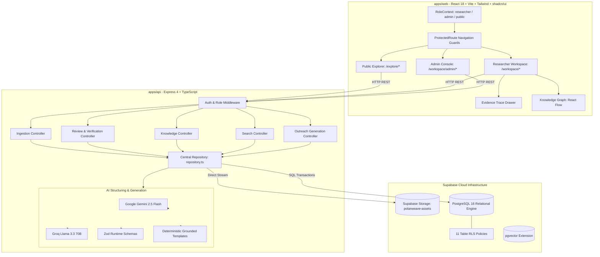

# POLARWEAVE

> **"From fragmented evidence to connected polar knowledge."**

[](https://sih.gov.in)
[](https://ncpor.res.in)
[-10B981.svg?style=for-the-badge)]()
[-0ea5e9.svg?style=for-the-badge)]()
[]()
[]()

**POLARWEAVE** is a modern, high-precision scientific knowledge repository and media dissemination platform engineered for the **Ministry of Earth Sciences (MoES)** and the **National Centre for Polar and Ocean Research (NCPOR)**. Built for **SIH26063** (*Integrated Polar Science Outreach, Knowledge Repository and Media Dissemination Portal*), POLARWEAVE addresses the critical challenge of unifying decades of heterogeneous polar research material from Antarctica, the Arctic, and the Southern Ocean (Bharati, Maitri, Himadri stations) into structured, evidence-backed knowledge.

---

## 📌 Table of Contents

- [The Core Challenge & Innovation](#-the-core-challenge--innovation)
- [Hero Feature: Evidence Trace ("Why do you believe this?")](#-hero-feature-evidence-trace)
- [Role-Based Access Control (RBAC)](#-role-based-access-control-rbac)
- [System Architecture](#-system-architecture)
- [Authoritative Persistence & Database Schema](#-authoritative-persistence--database-schema)
- [Multimodal Ingestion & Processing Pipeline](#-multimodal-ingestion--processing-pipeline)
- [Knowledge Graph & Outreach Studio](#-knowledge-graph--outreach-studio)
- [Monorepo Directory Structure](#-monorepo-directory-structure)
- [Local Setup & Quickstart](#-local-setup--quickstart)
- [Verification & Automated Test Suites](#-verification--automated-test-suites)
- [SIH 4-Minute Judging Demonstration Script](#-sih-4-minute-judging-demonstration-script)
- [API Reference](#-api-reference)
- [Scientific Integrity & Security](#-scientific-integrity--security)

---

## 🔬 The Core Challenge & Innovation

Polar research is messy, high-friction, and unstructured. Scientific missions generate disparate artifacts:
- **Expedition Reports:** Multi-page scanned and technical PDFs with embedded charts.
- **Sensor Feeds:** Large tabular CSV/XLSX logs from Automatic Weather Stations (AWS) and ice core boreholes.
- **Field Diaries:** DOCX field notes recording glaciological and biological observations.
- **Photographs & Audio:** High-resolution field photos with sensor parameters and acoustic recordings.
- **Video Dispatches:** Station operations, drone overflights, and scientist interviews.

Most standard portals reduce this to a static file list or a generic chatbot prone to hallucinations. **POLARWEAVE rejects this pattern.**

```
                     UNSTRUCTURED SCIENTIFIC MATERIAL
            (PDF Reports, CSV Sensors, Word Diaries, Field Media)
                                  │
                                  ▼
                     MULTIMODAL INGESTION SERVICE
                (Streamed to Supabase Storage: polarweave-assets)
                                  │
                                  ▼
                   DETERMINISTIC EXTRACTION ENGINE
              (pdf-parse, mammoth DOCX, xlsx tabular streams)
                                  │
                                  ▼
                     AI STRUCTURING & ZOD VALIDATION
          (Gemini 2.5 Flash / Groq Llama 3.3 ➔ Strict JSON Schema)
                                  │
                                  ▼
                   HUMAN-IN-THE-LOOP REVIEW QUEUE
          (Researcher Validation: AI_EXTRACTED ➔ NEEDS_REVIEW ➔ VERIFIED)
                                  │
                                  ▼
                     CROSS-MODAL EVIDENCE TRACE
          (Every claim linked to page, row, timestamp, or EXIF)
                                  │
                                  ▼
                     CONNECTED KNOWLEDGE GRAPH
                (Interactive React Flow Semantic Triples)
                                  │
                                  ▼
                 EVIDENCE-LOCKED DISSEMINATION STUDIO
          (Press releases, articles, LinkedIn posts with citations)
```

---

## 🔍 Hero Feature: Evidence Trace

The central differentiator of POLARWEAVE is **Evidence Trace**. In scientific governance, an LLM summary without provenance is a liability. Every observation stored in POLARWEAVE can answer: **"Show me why you believe this."**

When an auditor, researcher, or citizen clicks **"Why do you believe this?"**, POLARWEAVE opens the evidence drawer, revealing the exact multi-source proof chain:

```
┌─────────────────────────────────────────────────────────────────────────────┐
│ CLAIM: "Surface ice thickness recorded at 1.80 m along Larsemann fast-ice" │
│ Extraction Confidence: 94% (HIGH)  │  Status: VERIFIED                      │
├─────────────────────────────────────────────────────────────────────────────┤
│ ├── [📄 Report Excerpt]                                                     │
│ │   report_expedition_45_final.pdf · Page 17 · Section 3.2.1               │
│ │   "In-situ mechanical core extraction yielded uncompressed thickness of   │
│ │    1.80 m along the coastal fast-ice line."                               │
│ │                                                                           │
│ ├── [📊 Tabular Calibration]                                                │
│ │   ice_measurements_larsemann.csv · Row #42                                │
│ │   core_id=IC-45-42 | depth_m=21.0 | thickness_m=1.80 | temp_c=-14.8       │
│ │                                                                           │
│ ├── [🎥 Video Timestamp]                                                    │
│ │   scientist_interview.mp4 · 12:43 – 12:58                                 │
│ │   "We calibrated the thermistor probe at exactly 1.8 meters fast-ice."   │
│ │                                                                           │
│ └── [📷 Geotagged Media]                                                    │
│     IMG_2041.jpg · Bharati Station Coastline (-69.4089°S, 76.1872°E)        │
└─────────────────────────────────────────────────────────────────────────────┘
```

---

## 👥 Role-Based Access Control (RBAC)

POLARWEAVE enforces three isolated operational user journeys. Role state is managed via `RoleContext`, persisted defensively in `localStorage`, and enforced through `ProtectedRoute` route guards:

| Capability / Journey | 🧪 Researcher | 🛡️ Knowledge Admin | 🌐 Public Explorer |
|---|:---:|:---:|:---:|
| **Target Audience** | NCPOR Scientists & Field Observers | MoES/NCPOR Knowledge Managers | Citizens, Students, Educators, Press |
| **Default Landing Route** | `/workspace` | `/workspace` | `/explore` |
| **Multimodal Ingest & Upload** | ✅ | ✅ | ❌ *(Redirected)* |
| **Processing Jobs Queue** | ✅ | ✅ | ❌ *(Redirected)* |
| **Human Review & Verification** | ✅ | ✅ | ❌ *(Redirected)* |
| **Evidence Trace Inspection** | ✅ | ✅ | ✅ *(Public Verified Only)* |
| **Interactive Knowledge Graph** | ✅ | ✅ | ✅ *(Public Verified Only)* |
| **Outreach Generation Studio** | ✅ | ✅ | ❌ *(Redirected)* |
| **Admin User Management** | ❌ *(Redirected)* | ✅ | ❌ *(Redirected)* |
| **Taxonomy & Vocabularies** | ❌ *(Redirected)* | ✅ | ❌ *(Redirected)* |
| **Institutional Activity & Logs** | ❌ *(Redirected)* | ✅ | ❌ *(Redirected)* |
| **Public Editorial Explorer** | ✅ | ✅ | ✅ |

---

## 🏗️ System Architecture



---

## 🗄️ Authoritative Persistence & Database Schema

POLARWEAVE uses **Supabase PostgreSQL** as its primary source of truth, backed by **Supabase Storage** for binary preservation. `memoryStore` serves strictly as an in-memory cache and resilient offline demo fallback.

### Verified Relational Tables (16 Core Entities)

1. `profiles` — User profiles linked to Supabase Auth UUIDs, institutions, and roles.
2. `expeditions` — Indian Antarctic (39th, 44th, 45th), Arctic, and Southern Ocean expeditions.
3. `locations` — Polar stations (Bharati, Maitri, Himadri), glaciers, and Larsemann Hills coordinates.
4. `researchers` — Principal investigators, domains, and institutional affiliations.
5. `documents` — Metadata, storage paths, MIME types, and page counts for uploaded reports.
6. `document_chunks` — Page-by-page and paragraph text chunks with token estimates.
7. `datasets` — Scientific datasets, column schemas, row counts, and preview rows.
8. `observations` — Structured scientific facts with confidence scores and verification enums (`AI_EXTRACTED`, `NEEDS_REVIEW`, `VERIFIED`, `REJECTED`).
9. `measurements` — Discrete numerical measurements (e.g., `-32.4°C`, `1.80m`, `18.2 m/s`) linked to observations.
10. `publications` — Peer-reviewed papers, journals, abstracts, and DOIs.
11. `media_assets` — High-res field photographs, video dispatches, transcripts, and camera metadata.
12. `evidence_links` — Provenance links binding extracted observations to pages, rows, timestamps, and excerpts.
13. `knowledge_relationships` — Graph edges (`source_entity`, `predicate`, `target_entity`) powering the semantic knowledge graph.
14. `processing_jobs` — Real-time state machine for ingest jobs (`queued`, `processing`, `completed`, `failed`).
15. `verification_records` — Immutable audit trail capturing human review actions, reviewer names, notes, and previous/new values.
16. `generated_content` — Dissemination outputs (press releases, articles, LinkedIn posts) with source citations.

### Storage Bucket Configuration
- **Bucket:** `polarweave-assets` (Public Read + RLS Protected Writes)
- **Path Structure:**
  - `documents/` — Expedition reports, PDF documents, and DOCX notes.
  - `datasets/` — Sensor CSVs and telemetry spreadsheets.
  - `images/` — Field photographs and satellite imagery.
  - `videos/` — Drone footage and scientist dispatches.
  - `thumbnails/` — Media preview cards.
  - `generated/` — Exported outreach materials.

---

## ⚡ Multimodal Ingestion & Processing Pipeline

Uploaded research packages pass through a multi-stage validation and parsing pipeline:

```
[File Received] ──► [MIME & Size Validation] ──► [Stream to Supabase Storage]
                                                          │
                                                          ▼
                                               [Create processing_jobs Row]
                                                          │
   ┌───────────────────────┬──────────────────────────────┴────────────────────────────┐
   ▼                       ▼                                                           ▼
[PDF Parser]         [DOCX Parser]                                              [Tabular Parser]
pdf-parse:           mammoth:                                                   xlsx (SheetJS):
- Page counts        - Paragraph extraction                                     - Column types
- Text buffers       - Heading hierarchies                                      - Row counts
- Page chunks        - Document chunks                                          - Preview rows
   │                       │                                                           │
   └───────────────────────┼───────────────────────────────────────────────────────────┘
                           │
                           ▼
              [AI Structuring Engine]
      (Gemini 2.5 Flash / Groq Llama 3.3)
      - Extract discrete observations
      - Extract measurements & units
      - Validate with Zod schemas
                           │
                           ▼
           [Cross-Modal Evidence Linking]
      - Link observation ➔ Report page
      - Link observation ➔ Dataset row
      - Link observation ➔ Video transcript
                           │
                           ▼
             [Database Commitment & Graph]
      - INSERT INTO observations
      - INSERT INTO evidence_links
      - INSERT INTO knowledge_relationships
      - UPDATE processing_jobs (completed)
```

---

## 🕸️ Knowledge Graph & Outreach Studio

### 1. Interactive Knowledge Graph (`/workspace/knowledge`)
Powered by `@xyflow/react` (React Flow), the semantic graph visualizes the interconnected nature of polar science:
- **Expedition Nodes:** High-level expedition hubs (e.g., *45th Indian Scientific Expedition to Antarctica*).
- **Location Nodes:** Geographic bases (*Bharati Research Station*, *Larsemann Hills*).
- **Observation Nodes:** Color-coded scientific claims tagged by domain (Glaciology, Meteorology, Cryosphere Dynamics).
- **Dataset Nodes:** Tabular calibration sources (*Fast-Ice Borehole CSV*).
- **Media Nodes:** Expedition photographs and recorded interviews.
- **Dynamic Controls:** Full zoom, pan, category filter (Glaciology, Biology, Meteorology), and interactive node inspector drawer.

### 2. Evidence-Locked Outreach Studio (`/workspace/outreach`)
Transforming dense scientific facts into verified public communication:
- **Target Formats:** Website Article, Public Explainer, Student Explainer, LinkedIn Post, Social Caption, Press Release, Institutional Newsletter.
- **Audience Adaptation:** General Public, Students, Educators, Scientific Community, Policy Makers.
- **Citation Locking:** Generated text embeds bracketed citations (e.g., `[Source: Doc/Expedition]`) that connect directly to the source document ID and page number.

---

## 📂 Monorepo Directory Structure

```
POLARWEAVE/
├── apps/
│   ├── web/                           # React 18 + Vite Frontend Application
│   │   ├── src/
│   │   │   ├── components/            # UI components, AppShell, Sidebar, Topbar, EvidenceDrawer
│   │   │   ├── context/               # RoleContext (researcher, admin, public)
│   │   │   ├── data/                  # High-fidelity baseline seed datasets
│   │   │   ├── lib/                   # API client, Supabase client, utilities
│   │   │   ├── pages/
│   │   │   │   ├── auth/              # LoginPage, SignupPage
│   │   │   │   ├── public/            # LandingPage, ExplorePage
│   │   │   │   └── workspace/         # Ingest, Processing, Review, Evidence, KnowledgeGraph,
│   │   │   │                          # Expeditions, Datasets, Media, Outreach, Search, Admin
│   │   │   └── routes/                # ProtectedRoute and AppRoutes.tsx
│   │   └── test/                      # RBAC isolation test suite
│   │
│   └── api/                           # Node.js + Express Backend Service
│       ├── src/
│       │   ├── ai/                    # Gemini & Groq structuring, linking, outreach, search
│       │   ├── config/                # Environment schema validation (env.ts)
│       │   ├── controllers/           # Ingest, Knowledge, Evidence, Review, Search, Outreach
│       │   ├── data/                  # In-memory demo store & seed records
│       │   ├── db/                    # Supabase client & centralized repository.ts
│       │   ├── ingestion/             # PDF, DOCX, and Tabular parsers
│       │   └── routes/                # Express REST endpoint declarations
│       └── test/                      # Smoke & PostgreSQL persistence test suites
│
├── packages/
│   ├── types/                         # Shared TypeScript interfaces, DTOs, and Zod schemas
│   └── config/                        # Shared ESLint and TypeScript configs
│
├── supabase/
│   └── migrations/                    # PostgreSQL migrations:
│       ├── 20260330000001_initial_polarweave_schema.sql  # 16 Core tables, enums, RLS
│       ├── 20260330000002_seed_demo_records.sql          # Seed demo records
│       ├── 20260330000003_storage_buckets.sql            # polarweave-assets bucket & policies
│       └── 20260330000004_api_rls_policies.sql           # Backend service CRUD RLS policies
│
├── .env.example                       # Root environment template
├── package.json                       # Turborepo / npm workspaces configuration
└── README.md                          # Full system documentation
```

---

## 🚀 Local Setup & Quickstart

### Prerequisites
- **Node.js:** `>= 18.0.0` (Tested on Node.js v22 and v25)
- **npm:** `>= 9.0.0`
- **Git**

### 1. Clone the Repository
```bash
git clone https://github.com/aditya-codes-git/POLARWEAVE.git
cd POLARWEAVE
```

### 2. Install Dependencies
```bash
npm install
```

### 3. Environment Variables Configuration
Configure environment files for both `apps/api` and `apps/web`:

**Root / Backend Configuration (`apps/api/.env`):**
```env
PORT=5000
CLIENT_URL=http://localhost:5173
NODE_ENV=development

# Supabase Credentials (Connected to live project)
SUPABASE_URL=https://bypbibjwgayyahlnwvnu.supabase.co
SUPABASE_PUBLISHABLE_KEY=sb_publishable_8YgTxjHj3mEenh12DxfwmA_Xk7D4UpK
SUPABASE_ANON_KEY=eyJhbGciOiJIUzI1NiIsInR5cCI6IkpXVCJ9...

# Multimodal AI Engines
GEMINI_API_KEY=AQ.Ab8RN6JOjPvMlKnwsAw_rhCHbEWcHTFD14OU6Q_iNLit2ddGDQ
GROQ_API_KEY=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

# File Limits
MAX_UPLOAD_SIZE_MB=100
```

**Frontend Configuration (`apps/web/.env`):**
```env
VITE_API_URL=http://localhost:5000
VITE_SUPABASE_URL=https://bypbibjwgayyahlnwvnu.supabase.co
VITE_SUPABASE_PUBLISHABLE_KEY=sb_publishable_8YgTxjHj3mEenh12DxfwmA_Xk7D4UpK
VITE_DEMO_MODE=false
```

### 4. Build Monorepo
Compile shared packages, backend TypeScript, and frontend production bundles:
```bash
npm run build
```

### 5. Launch Development Servers
Start both the Express API and Vite React frontend concurrently:
```bash
npm run dev
```
- **Frontend Portal:** `http://localhost:5173`
- **Backend API:** `http://localhost:5000`
- **API Health Check:** `http://localhost:5000/api/health`

---

## 🧪 Verification & Automated Test Suites

POLARWEAVE includes automated test coverage validating API contracts, role guards, and database persistence.

### 1. API Pipeline Smoke Tests
Validates scientific Zod schemas, tabular parsing, cross-modal linking logic, and grounded Q&A:
```bash
npx tsx test/smoke.test.ts # from apps/api
```
*Output: `6/6 passed in 12ms`*

### 2. RBAC Role Isolation Tests
Validates sidebar isolation, admin route guarding, and public explore restrictions:
```bash
npx tsx test/rbac.test.ts # from apps/web
```
*Output: `5/5 passed in 7ms`*

### 3. Database Persistence & Cold Restart Test
Performs real Supabase Storage upload, writes to 7 PostgreSQL tables, executes human review approval, restarts client without memory store, and reads back persisted records:
```bash
npx tsx test/persistence.test.ts # from apps/api
```
*Output: `10/10 passed in 9.8s`*

---

## 🎬 SIH 4-Minute Judging Demonstration Script

Follow this structured workflow to demonstrate POLARWEAVE to hackathon judges:

### ⏱️ Minute 0:00 – 0:45: The Problem & Vision
1. Open `http://localhost:5173`.
2. Present the core premise:
   > *"Polar research from Antarctica and the Arctic does not arrive as a neat database. It arrives as dense expedition reports, raw AWS spreadsheets, field notes, and video files. Traditional portals either dump raw files in a list or put a generic chatbot on top that hallucinates. POLARWEAVE transforms fragmented evidence into connected polar knowledge with end-to-end provenance."*

### ⏱️ Minute 0:45 – 1:30: Ingest & Intelligence Pipeline
1. Click **"Open Knowledge Workspace"** and navigate to **/workspace/ingest**.
2. Point out the active role: **Researcher (Scientific Contributor)**.
3. Show the staged research package: `expedition_45_climatology_survey.pdf`, `ice_borehole_data.csv`, `field_observations.docx`.
4. Click **"Process Materials"**:
   - Show the real-time processing stages: Uploaded ➔ Parsed ➔ Extracted ➔ Structured ➔ Linked ➔ Completed.
   - Explain: *"Every stage writes to `processing_jobs` and uploads binaries to Supabase Storage `polarweave-assets`."*

### ⏱️ Minute 1:30 – 2:15: Human-in-the-Loop Review
1. Navigate to **Review Queue** (`/workspace/review`).
2. Open an extracted observation: `Surface ice measurement recorded at 1.8 m`.
3. Highlight the 3-column verification view:
   - **Left:** Source proof excerpt from Report p.17.
   - **Center:** AI-extracted parameters and confidence score (94%).
   - **Right:** Researcher verification action.
4. Click **"Approve & Verify"**.
   - Explain: *"This is immediately committed to PostgreSQL `verification_records` with an immutable audit trail."*

### ⏱️ Minute 2:15 – 3:00: The WOW Factor — Evidence Trace
1. Open **Evidence Trace** (`/workspace/evidence`).
2. Click **"Why do you believe this?"**:
   - Reveal the 4-way cross-modal evidence chain:
     - Document excerpt (Report p.17)
     - Dataset telemetry (CSV row #42)
     - Video timestamp (12:43 in scientist interview)
     - Geotagged photograph (Bharati Station margin)
   - Explain: *"This is POLARWEAVE's hero differentiator: complete scientific traceability."*

### ⏱️ Minute 3:00 – 3:30: Connected Knowledge Graph
1. Navigate to **Knowledge Graph** (`/workspace/knowledge`).
2. Show the interactive React Flow canvas linking Expedition 45 ➔ Bharati Station ➔ Observation ➔ Borehole Dataset ➔ Interview Media.
3. Toggle category filters (Glaciology, Meteorology) and open the node inspector.

### ⏱️ Minute 3:30 – 4:00: Outreach Studio & Public Explorer
1. Navigate to **Outreach Studio** (`/workspace/outreach`).
2. Select format **"LinkedIn Post"** for audience **"Researcher"** and click **"Generate Content"**.
3. Highlight the live AI-generated post with locked citations (`[Source: Doc/Expedition]`).
4. Switch role to **Public Explorer** via the topbar profile popover.
5. Demonstrate that the internal operational tools disappear, replaced by the public editorial discovery portal displaying only verified scientific findings.

---

## 📡 API Reference

The Express backend (`http://localhost:5000`) provides REST endpoints for client applications:

| Method | Endpoint | Description | Backed By |
|---|---|---|---|
| `GET` | `/api/health` | Service health status and timestamp | In-memory |
| `POST` | `/api/ingest/upload` | Uploads binaries to Supabase Storage bucket | Supabase Storage (`polarweave-assets`) |
| `POST` | `/api/ingest/process` | End-to-end ingestion, parsing, AI extraction, and linking | PostgreSQL + Supabase Storage |
| `GET` | `/api/processing/jobs` | Retrieves recent ingestion jobs and stages | PostgreSQL (`processing_jobs`) |
| `GET` | `/api/processing/jobs/:id` | Retrieves a specific job by ID | PostgreSQL (`processing_jobs`) |
| `GET` | `/api/knowledge` | Queries observations with domain/status filters | PostgreSQL (`observations`) |
| `GET` | `/api/knowledge/:id` | Fetches observation detail, measurements, and evidence | PostgreSQL (`observations`, `measurements`) |
| `GET` | `/api/knowledge/graph` | Returns nodes and edges formatted for React Flow | PostgreSQL (`knowledge_relationships`) |
| `GET` | `/api/evidence/:knowledgeId` | Returns cross-modal evidence chain for a claim | PostgreSQL (`evidence_links`) |
| `POST` | `/api/review/:entityType/:id` | Approves, edits, or rejects an extracted entity | PostgreSQL (`verification_records`) |
| `POST` | `/api/outreach/generate` | Generates audience-specific outreach with locked citations | Gemini / Groq + PostgreSQL (`generated_content`) |
| `GET` | `/api/outreach` | Retrieves history of generated outreach items | PostgreSQL (`generated_content`) |
| `GET` | `/api/search` | Search across expeditions, observations, datasets, media | PostgreSQL |
| `POST` | `/api/search/ask-the-evidence` | Grounded Q&A over verified polar knowledge | AI Grounding Engine |

---

## 🔒 Scientific Integrity & Security

1. **Zero Raw Hallucination:** "Ask the Evidence" prompts reject ungrounded speculation. If no verified evidence supports an answer, the engine returns an explicit fallback: *"No verified knowledge matching this query was found in the archive."*
2. **Server-Side Key Handling:** AI API keys (`GEMINI_API_KEY`, `GROQ_API_KEY`) and backend service keys are strictly confined to the Express server environment and are never leaked to the client.
3. **Row Level Security (RLS):** All 16 PostgreSQL tables enforce RLS policies, allowing public access only to verified scientific observations, locations, and published expeditions.
4. **Input Sanitization & Limits:** Multer limits file sizes to 100MB and verifies MIME types against white-listed scientific file formats.

---

## 🏛️ Attribution & Acknowledgments

- **Challenge:** SIH26063 — Integrated Polar Science Outreach, Knowledge Repository and Media Dissemination Portal
- **Organization:** Ministry of Earth Sciences (MoES), Government of India
- **Department:** National Centre for Polar and Ocean Research (NCPOR), Goa, India
- **Stations Referenced:** Bharati Station (Larsemann Hills), Maitri Station (Schirmacher Oasis), Himadri Station (Ny-Ålesund, Svalbard).
- **Developed by:** Team POLARWEAVE for the Smart India Hackathon.
